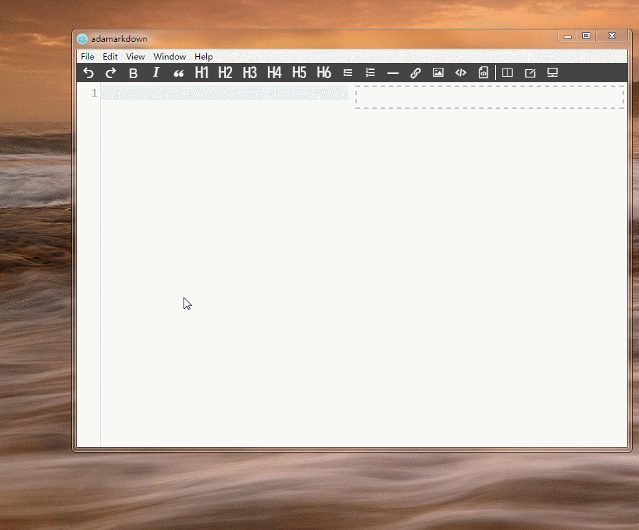
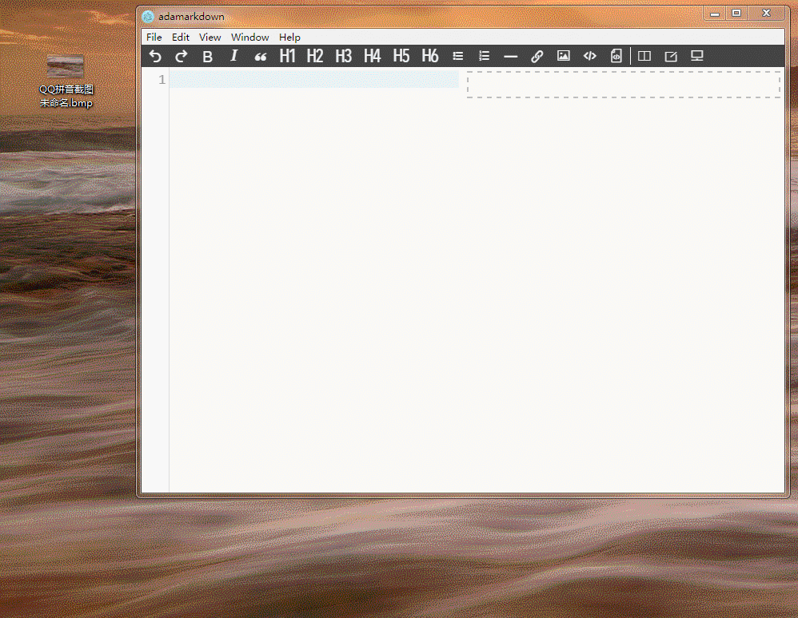

# adamarkdown

> A markdown editor based on Electron and Vue

一个基于Electron和Vue的markdown编辑器，数据存储在Leancloud

# Todos
- [ ] 工具栏（部分）
  - [ ] 用户退出
  - [x] 新建文件
  - [ ] 保存文件
  - [ ] 删除文件
  - [x] 撤销
  - [x] 重做
  - [x] 加粗
  - [x] 斜体
  - [x] 引用
  - [x] 标题1
  - [x] 标题2
  - [x] 标题3
  - [x] 标题4
  - [x] 标题5
  - [x] 标题6
  - [x] 无序列表
  - [x] 有序列表
  - [x] 横线
  - [x] 链接
  - [x] 图像
  - [x] 行内代码
  - [x] 块状代码
  - [x] 分割符
  - [x] 实时预览
  - [x] 编辑模式
  - [x] 阅读模式
  - [x] 打开本地文件
  - [x] 保存到本地
  - [ ] 保存HTML（附带样式）
- [x] 图片上传（直接上传、拖拽上传、截图粘贴上传）
- [x] 视图同步（参考simplemde代码实现，原理待研究）
- [x] 支持gfm,tasklist
- [x] 文章目录toc
- [ ] 代码高亮
- [ ] 本地打开、保存
- [ ] 文章分类
- [ ] 文章管理
- [ ] 图像管理
- [ ] pdf输出
- [ ] 访问权限控制
  - [ ] 文章访问权限控制
  - [ ] 图片防盗
  
  
# 截图

截图粘贴上传

拖拽上传图片

