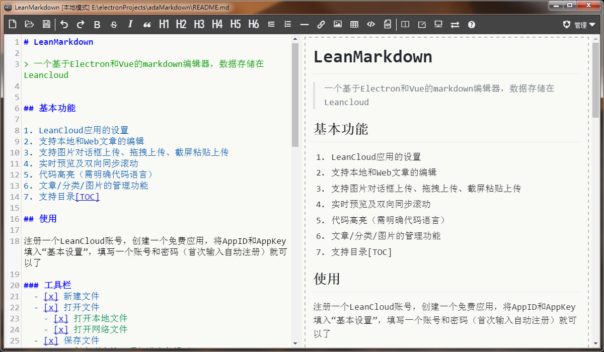

# LeanMarkdown

> 一个基于Electron和Vue的markdown编辑器，数据存储在Leancloud

## 基本功能

1. LeanCloud应用的设置
2. 支持本地和Web文章的编辑
3. 支持图片对话框上传、拖拽上传、截屏粘贴上传
4. 实时预览及双向同步滚动
5. 代码高亮（需明确代码语言）
6. 文章/分类/图片的管理功能
7. 支持目录[TOC]

## 使用

注册一个LeanCloud账号，创建一个免费应用，将AppID和AppKey填入“基本设置”，填写一个账号和密码（首次输入自动注册）就可以了

### 工具栏
  - [x] 新建文件
  - [x] 打开文件
  	- [x] 打开本地文件
  	- [x] 打开网络文件
  - [x] 保存文件
  	- [x] 保存到本地（顶部进度条提示）
  	- [x] 保存到网络
  - [x] 删除文件
  - [x] 撤销(Ctrl+Z)
  - [x] 重做
  - [x] 加粗(Ctrl+B)
  - [x] 斜体(Ctrl+I)
  - [x] 引用(Ctrl+Q)
  - [x] 标题1(Ctrl+1)
  - [x] 标题2(Ctrl+2)
  - [x] 标题3(Ctrl+3)
  - [x] 标题4(Ctrl+4)
  - [x] 标题5(Ctrl+5)
  - [x] 标题6(Ctrl+6)
  - [x] 无序列表(Ctrl+Shift+U)
  - [x] 有序列表(Ctrl+Shift+O)
  - [x] 横线(Ctrl+H)
  - [x] 链接(Ctrl+L或Ctrl+Shift+L)
  - [x] 图像(Ctrl+Shift+P)
  - [x] 表格
  - [x] 行内代码(Ctrl+K)
  - [x] 块状代码(Ctrl+Shift+K)
  - [x] 实时预览
  - [x] 编辑模式
  - [x] 阅读模式
  - [x] 左右交换
  - [x] 图片上传（对话框上传、拖拽上传、截图粘贴上传）
  - [x] 视图同步
  - [x] 支持gfm,tasklist
  - [x] 文章目录toc
  - [x] 代码高亮
  - [x] MD文件拖拽打开（直接拖拽至编辑器）
  - [x] 文章分类
  - [x] 文章管理
  - [x] 图像管理
  - [ ] pdf输出
  - [ ] 保存HTML（附带样式）
  - [ ] 访问权限控制
    - [ ] 文章访问权限控制
    - [ ] 图片防盗
  
### 非工具栏的编辑功能
- [x] 向后添加行
- [x] 向前添加行
- [x] 插入代码块（Ctrl+Shift+K）

# 截图

截图粘贴上传

拖拽上传图片
